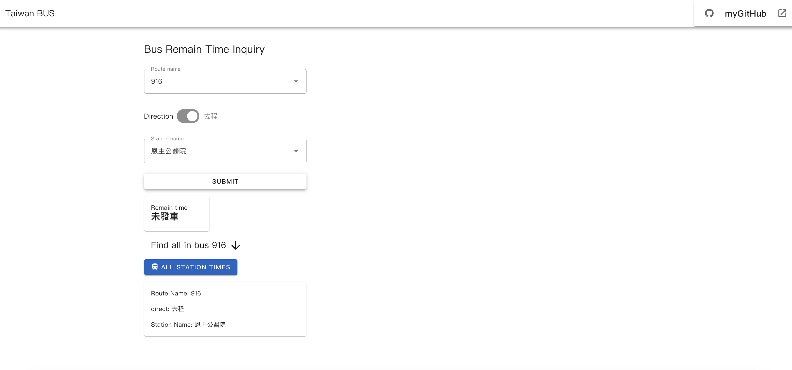
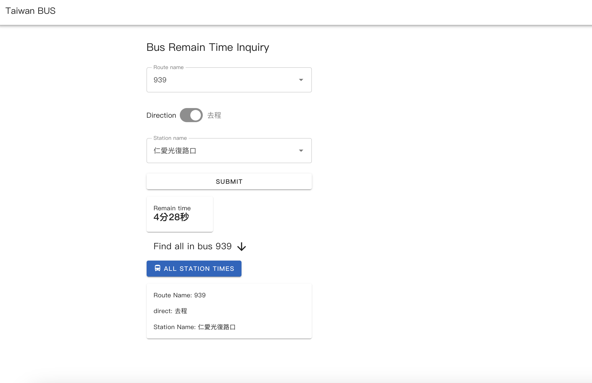
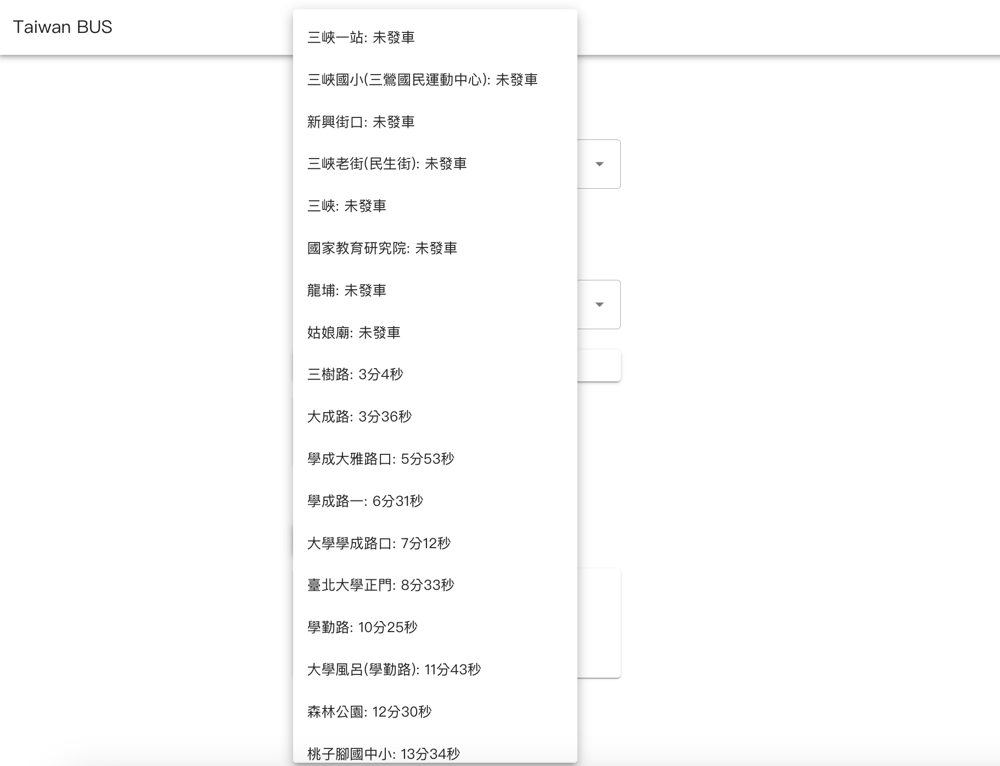
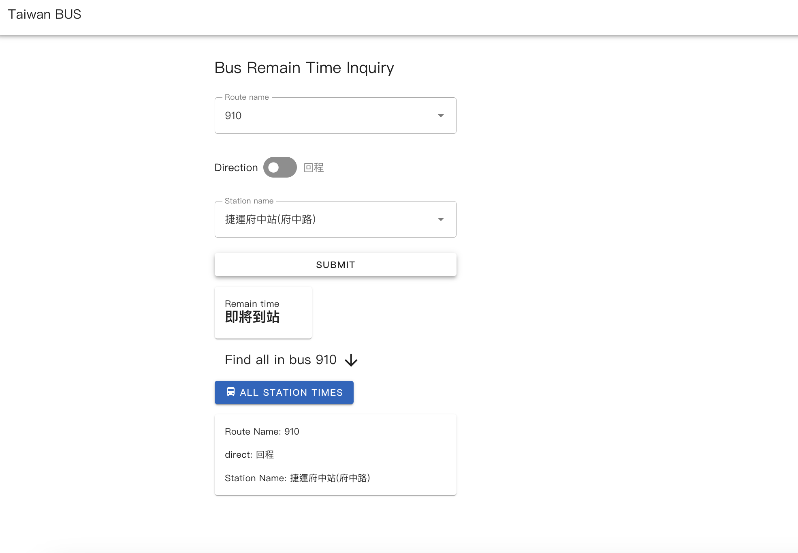

# Bus-Inquiry
It can increase the chances of catching the bus with accuracy down to the second.
## myproject
This template should help get you started developing with Vue 3 in Vite.  
The API used is written in python3 [simple-API](https://github.com/hsuan744172/simple-API).

## Use it 
Open the link [my bus web](https://hsuan744172.github.io/Bus-Inquiry/)  
and wait for a few minute to wake up the api(on Render)
,then you can inquire the bus arriving time.

## practical use
資料來源是大臺北公車網站

    -先選擇車號->去回程->站別 
    -每次選下一個想查詢的站都要重新按一次去回程
    -三分鐘內都會顯示即將進站
可以查看不同車的特定站點

可以查看全部站的進站狀況

三分鐘內都會顯示即將進站

